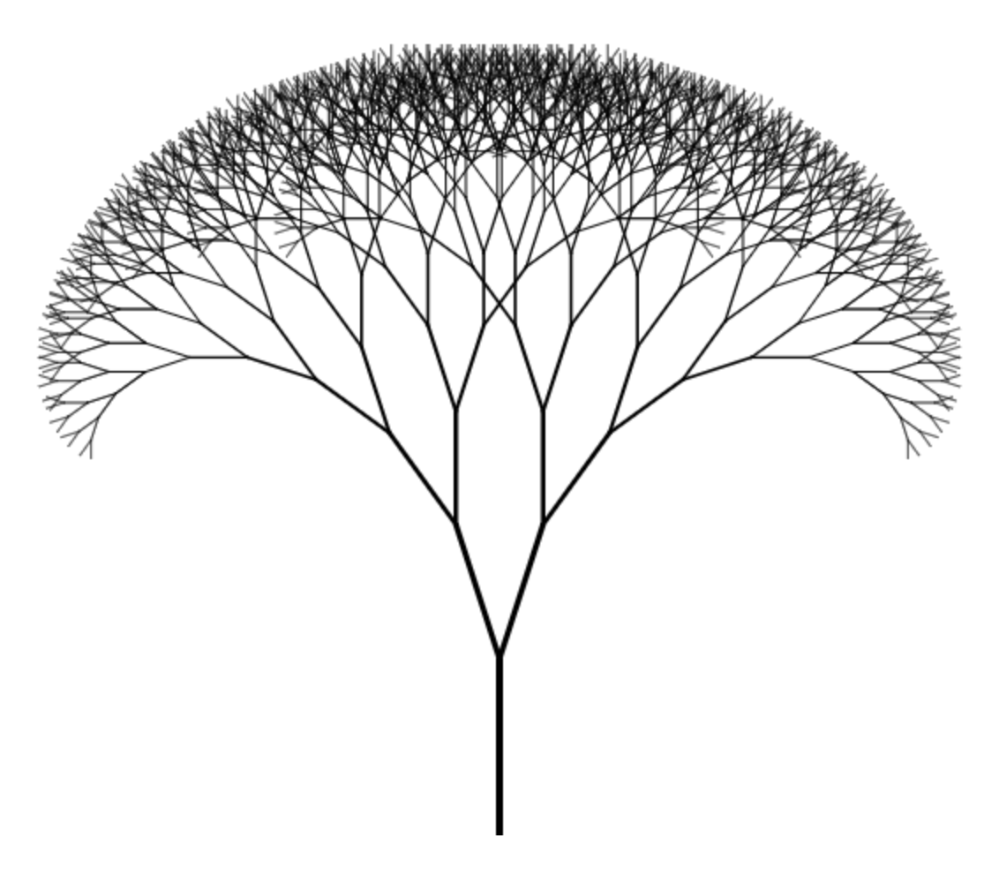

Fractal trees with fp-ts

Adapted from [Fractal trees with PureScript](http://blog.ploeh.dk/2017/06/06/fractal-trees-with-purescript/) by Mark Seemann



```ts
git clone https://github.com/gcanti/fractal-trees-ts.git
cd fractal-tree-ts
npm install
npm start
open example/test.html
```

